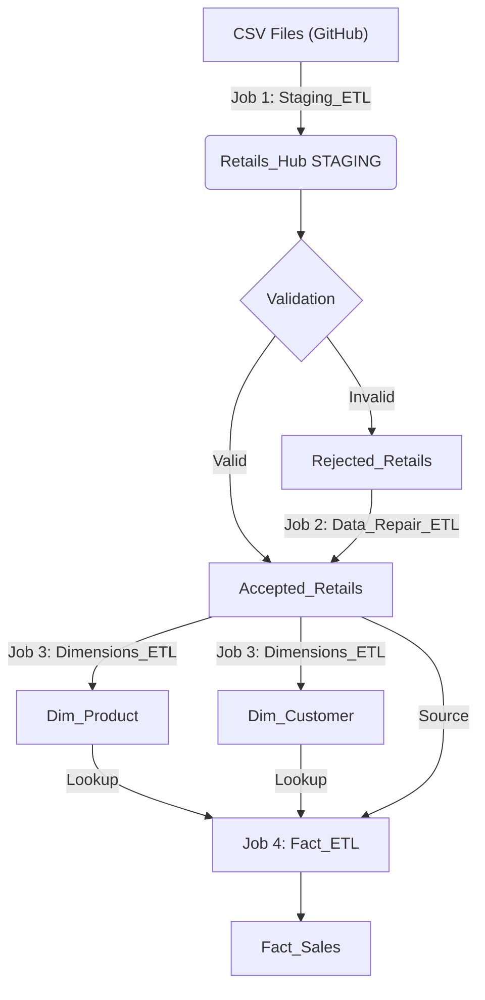

# Talend Retail ETL Pipeline

A full ETL (Extract, Transform, Load) pipeline built with **Talend Open Studio** for processing retail transaction data.  
It extracts CSV data, validates and cleanses it, and loads it into a **dimensional data warehouse** on Microsoft SQL Server.

---

## 📋 Project Overview

- **ETL Goals:** Data quality validation, incremental loading, dimensional modeling, error handling, and data reconciliation.  
- **Architecture:** Multi-stage ETL with staging, dimension, and fact tables.  
- **Key Features:**  
  - Automatic validation and rejection of invalid records  
  - Data repair and cleansing mechanism  
  - Star schema with slowly changing dimensions (SCD) support  
  - Incremental loading and duplicate prevention  

---

## 🏗️ Architecture

### Data Flow Overview


### Dimensional Data Warehouse Flow

1. **Job 1 (Staging):** Ingest raw data, validate, split into Accepted/Rejected.
2. **Job 2 (Repair):** Attempt to fix rejected data and move to Accepted.
3. **Job 3 (Dimensions):** Populate `Dim_Product` and `Dim_Customer`.
4. **Job 4 (Facts):** Load `Fact_Sales` using dimension lookups.

---

## 🎯 Key Features

### ✅ Data Quality & Validation
- **Type Conversion:** Validates String → Integer/Float/Date conversions.
- **Business Rules:** Enforces non-zero prices and valid ID formats.
- **Rejection Flow:** Automatic rejection of invalid records for manual review.
- **Data Repair:** Logic to fix recoverable errors automatically.

### ✅ Incremental Loading
- **Delta Loads:** Uses date-based filtering to process only new records.
- **Deduplication:** Prevents duplicate records using unique key validation.
- **Performance:** Efficient processing of large historical datasets.

### ✅ Dimensional Modeling
- **Star Schema:** Organized into Fact and Dimension tables.
- **Surrogate Keys:** Generates independent keys for dimensions.
- **SCD:** Support for Slowly Changing Dimensions (Type 1).

### ✅ Error Handling
- **Network Resilience:** Handles HTTP request failures (404, timeouts).
- **Logging:** Comprehensive logging and monitoring via `tLogCatcher`.
- **Reconciliation:** Tracks rejected records to ensure 100% data accounting.

---

## 🗂️ Database Schema

### 1. Staging Tables (ODS)

| Table | Description | Columns |
| :--- | :--- | :--- |
| **Retails_Hub** | Raw staging data | `InvoiceNo`, `StockCode`, `Description`, `Quantity`, `InvoiceDate`, `UnitPrice`, `CustomerID`, `Country` |
| **Accepted_Retails** | Validated data | `InvoiceNo` (INT), `StockCode` (INT), `Description` (VARCHAR), `Quantity` (INT), `InvoiceDate` (DATETIME), `UnitPrice` (FLOAT), `CustomerID` (INT), `Country` (VARCHAR) |
| **Rejected_Retails** | Invalid records | Same as Retails_Hub + `RejectionReason`, `ErrorCode` |

### 2. Data Warehouse Tables (DWH)

| Table | Description | Columns |
| :--- | :--- | :--- |
| **Dim_Product** | Product dimension | `ProductKey` (PK), `StockCode` (Unique), `Description` |
| **Dim_Customer** | Customer dimension | `CustomerKey` (PK), `CustomerID` (Unique), `Country` |
| **Fact_Sales** | Sales fact table | `SalesKey` (PK), `InvoiceNo`, `ProductKey` (FK), `CustomerKey` (FK), `InvoiceDate`, `Quantity`, `UnitPrice`, `TotalAmount` |
## 🔄 ETL Jobs

### Job 1: Staging_ETL
- **Purpose:** Extract data from source (HTTP/CSV), load to staging hub, and validate.
- **Source:** Dynamic URL generation based on date.
- **Logic:** `tMap` checks for nulls and data types.
- **Output:** Splits flow into `Accepted_Retails` and `Rejected_Retails`.

### Job 2: Data_Repair_ETL
- **Purpose:** Reprocess rejected records to fix recoverable errors.
- **Process Flow:**
```text
tDBInput (Rejected) → tMap_Repair (Apply Cleansing)
                       ├─→ Repaired → Accepted_Retails |
                       └─→ Still Invalid → Rejected_Retails_Final
```
### Job 3: Dimensions_ETL
- **Purpose:** Load dimension tables with unique business entities.

- **Process Flow:**
```text
tDBInput_Accepted 
  ├──→ tMap_Product → tAggregateRow (Dedup) → tDBOutput_Product (Upsert)
  └──→ tMap_Customer → tAggregateRow (Dedup) → tDBOutput_Customer (Upsert)
```
### Job 4: Fact_ETL
- **Purpose:** Load fact table with incremental updates and dimension lookups.
- **Process Flow:**
```text
1. tDBInput_Product  (Load Lookup)
2. tDBInput_Customer (Load Lookup)
3. tDBInput_Accepted (Read New Data)
       ↓
4. tMap_Fact (Inner Join with Dims to get Surrogate Keys)
       ↓
5. tDBOutput_Fact (Insert)
```
### Incremental Load Query:
```sql
SELECT * 
FROM Accepted_Retails
WHERE CAST(InvoiceDate AS DATE) > COALESCE(
    (SELECT CAST(MAX(InvoiceDate) AS DATE) FROM Fact_Sales),
    CAST('1900-01-01' AS DATE)
)
```
## 🚀 Getting Started

### Prerequisites
- **Talend Open Studio:** v7.x+
- **Microsoft SQL Server:** 2016+
- **Java:** JDK 8 or 11
- **Git**

### Installation
```bash
git clone https://github.com/yourusername/retail-etl-pipeline.git
cd retail-etl-pipeline
